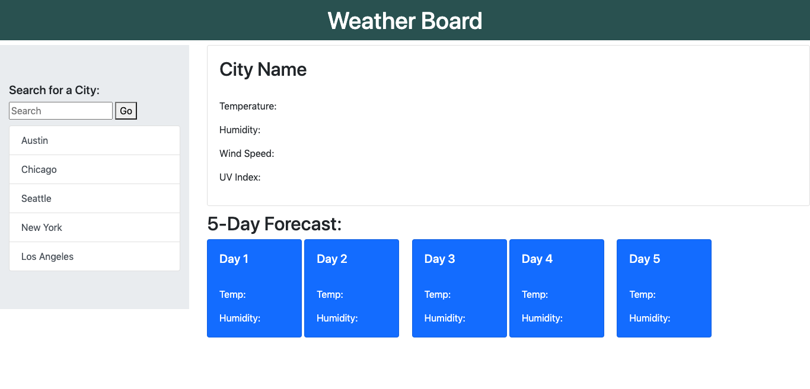
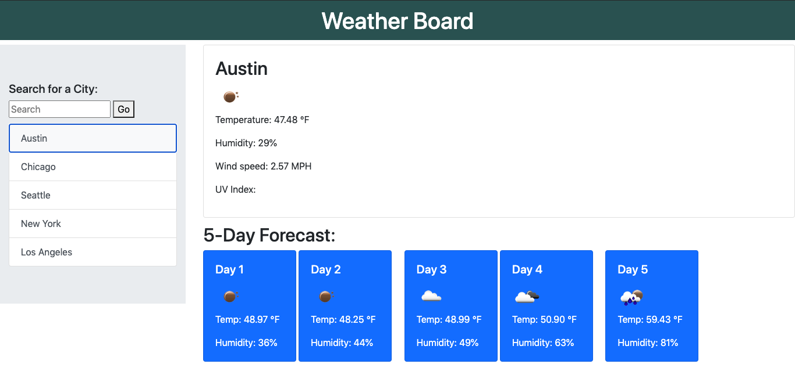
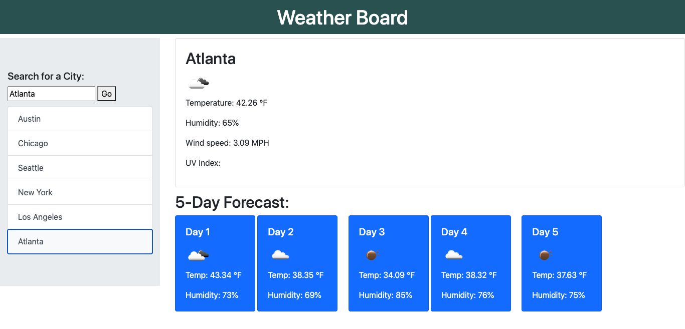

# Weather Dashboard
## Description
It's always convenient to know the weather you're about to experience ahead of time. You'll never know when you'll need an umbrella, some sunscreen, or a jacket. That's where a Weather Dashboard website would come in handy! Here, you can search for the weather in any city. The current weather conditions will be displayed on the top of the page first, and a five day forecast will appear on the bottom.

## Methods
On the lefthand side of the webpage, there's a default list of cities consisiting of some of the most populated areas in the U.S. An array was used to contain the city names, and a function is called to generate the list as buttons under the search bar. Whenever a new city is searched for, it is added to the array and the function is ran again.

The Open Weather API is used to get the weather data depending on the city name. Two different AJAX calls were used to get both the current weather and the 5-day forecast respectively.

The desired weather data would be added to the html via javascript depending on the response from the API.

## Deployed Application
https://charliecan2.github.io/WeatherDashboard